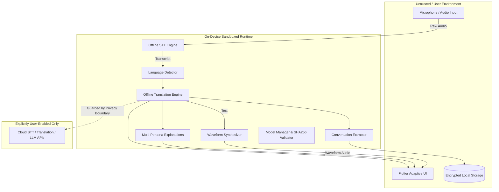

# Threat Model — UNICOM AI (Universal Communication Intelligence)

This document provides a systematic threat model for UNICOM AI based on STRIDE methodology, covering offline and cloud deployment boundaries, untrusted AI outputs, supply-chain risks, and audio/transcript privacy.

---

## 1. System Overview & Trust Boundaries

---

## 2. STRIDE Threat Analysis

### 2.1 Spoofing
- **Threat**: Attackers inject fabricated models or malicious language packs claiming to be official UNICOM AI assets.
- **Mitigation**: Every model in `ModelManager` is matched against hardcoded SHA-256 digests and cryptographic manifests. Model loading is blocked if the checksum does not match.

### 2.2 Tampering
- **Threat**: Malicious audio streams designed to trigger buffer overflows or denial-of-service in the STT parser.
- **Mitigation**: Audio input buffers are strictly size-capped, sample-rate normalized, and verified before decoding. Control characters are stripped via `TextUtils.sanitize()`.

### 2.3 Repudiation
- **Threat**: Meeting participants or interview candidates claim transcripts were altered or fabricated.
- **Mitigation**: Conversation segments contain millisecond timestamps, speaker identification, and SHA-256 hashes of generated reports, maintaining an auditable local history.

### 2.4 Information Disclosure (Privacy Leakage)
- **Threat**: Conversation transcripts, confidential interview questions, or proprietary trade secrets leak via network calls or application logs.
- **Mitigation**:
  - `private_offline` mode enforces an absolute network boundary. Invoking external APIs throws `OfflineViolationException`.
  - `PrivacyLogger` automatically redacts fields such as `text`, `originalText`, `translatedText`, `content`, `candidateAnswer`, and `audio` before serialization.
  - Zero analytics/telemetry transmitted without explicit opt-in.

### 2.5 Denial of Service (DoS)
- **Threat**: Large transcript inputs or repetitive explanation requests exhausting device memory or CPU battery.
- **Mitigation**: Virtualized lists in Flutter UI; lazy loading of heavy models; text truncation limits on individual segments; asynchronous non-blocking inference.

### 2.6 Elevation of Privilege
- **Threat**: Exploitation of container permissions or OS audio hooks to gain host root privileges.
- **Mitigation**: Rootless Podman execution; container users mapped to non-root UID/GID; no setuid binaries in container images.

---

## 3. Specific Vulnerability Classes & Countermeasures

### 3.1 Prompt Injection & Untrusted AI Outputs
- **Risk**: User-submitted or received text contains prompt injection instructions (`Ignore previous instructions and do X`).
- **Mitigation**: Rule-based linguistic parsing and deterministic translation algorithms are structurally immune to LLM prompt injection. When LLM completion adapters are used, system prompts and user inputs are strictly delineated with input delimiters, and outputs are treated as untrusted text rather than executable instructions.

### 3.2 Malicious Document & PDF Exports
- **Risk**: Exported PDF documents or Markdown files execute embedded malicious scripts or exploits in the recipient's reader.
- **Mitigation**: The `PdfExporter` generates pure standard Type-1 vector streams with escaped parentheses and backslashes, excluding JavaScript action dictionaries (`/JS`, `/JavaScript`). Markdown exports strip raw HTML tags.

### 3.3 Supply Chain & Dependency Security
- **Risk**: Compromised upstream dependencies in `pub.dev`.
- **Mitigation**: Dependencies are strictly pinned in `pubspec.yaml`, dependencies are audited via `dart pub outdated` and vulnerability scanners, and automated GitHub Actions scan dependencies on every pull request.
